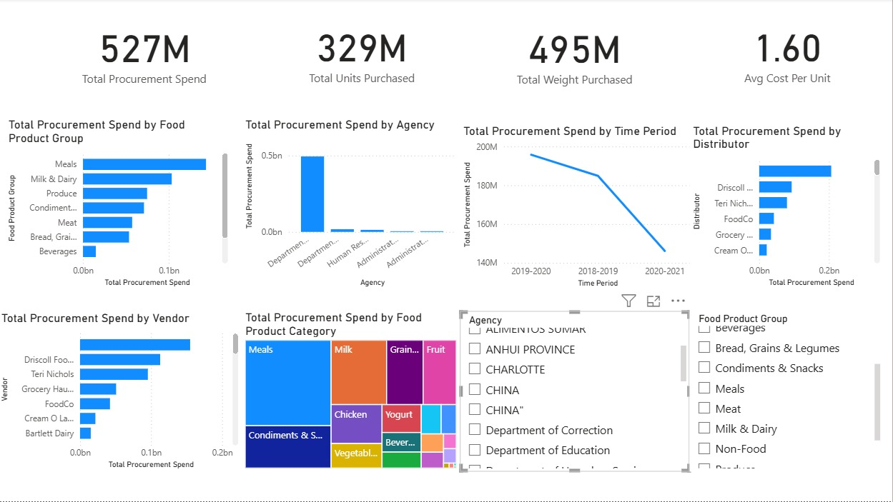

Food Procurement Analytics Dashboard
# Food Procurement Analytics Dashboard

## Project Overview

This project analyzes food procurement transactions across agencies, vendors, distributors, and product categories using Power BI and Python. The objective is to identify spending patterns, monitor supplier performance, and support data-driven procurement decisions.

## Tools & Technologies

* Power BI
* Python
* Pandas
* Matplotlib
* Excel
* GitHub

## Dataset Information

* Total Records: 17,208
* Procurement transactions from multiple agencies
* Includes vendor, distributor, product category, product group, units purchased, weight, and total cost information

## Key Performance Indicators (KPIs)

* Total Procurement Spend: $527M
* Total Units Purchased: 329M
* Total Weight Purchased: 495M lbs
* Average Cost Per Unit: $1.60

## Dashboard Features

### Procurement Spend Analysis

* Total spend by food product group
* Agency-wise procurement expenditure
* Procurement trend over time

### Vendor Performance Analysis

* Top vendors by procurement spend
* Supplier contribution analysis

### Product Category Analysis

* Food product category spend distribution
* Category-level procurement insights

### Interactive Filters

* Agency slicer
* Food Product Group slicer
* Dynamic dashboard filtering

## Dashboard Preview



## Key Insights

* Meals account for the highest procurement expenditure.
* Milk & Dairy is the second-largest spending category.
* Department of Education contributes the largest procurement spend.
* Procurement spending declined during the most recent reporting period.
* A small group of vendors contributes a significant portion of total procurement costs.

## Business Recommendations

* Monitor high-spend categories for cost optimization opportunities.
* Evaluate supplier performance regularly.
* Negotiate contracts with top vendors to improve procurement efficiency.
* Use procurement trend analysis for future budget planning.

## Repository Structure

```text
food-procurement-analytics-dashboard/
│
├── data/
│   └── food_procurement_cleaned.csv
│
├── dashboard/
│   └── Food_Procurement_Dashboard.pbix
│
├── python/
│   └── analysis.ipynb
│
├── dashboard.png
└── README.md
```

## Business Impact

This dashboard enables procurement teams to:

* Track spending across agencies and suppliers
* Identify procurement optimization opportunities
* Monitor supplier concentration risk
* Improve budget planning and purchasing decisions
* Support data-driven procurement strategies

## Author

**Sai Shashank R**

MBA – Business Analytics
CMS Business School, Jain (Deemed-to-be University)

## Connect With Me

* GitHub: https://github.com/shashankbond1999-netizen
* LinkedIn: Add your LinkedIn profile URL here
